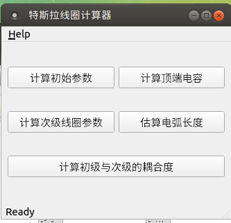
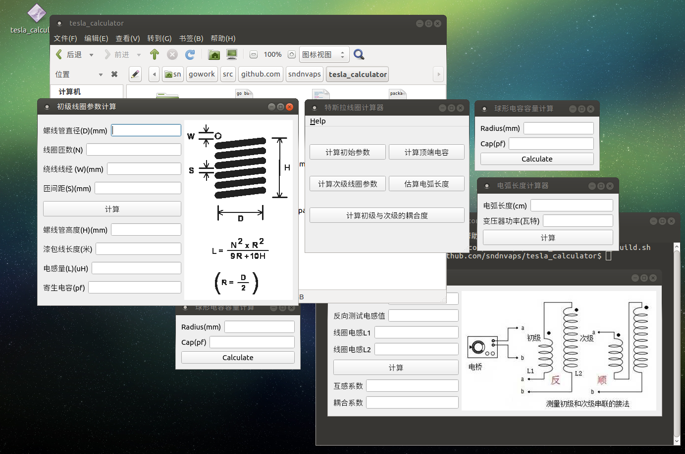

# Tesla_calculator

用于计算特斯拉线圈各项参数的小计算工具,基于[goqt](https://github.com/visualfc/goqt)开发


更新 [images](images)目录里面的图片的时候，需要使用[go-bindata](https://github.com/go-bindata/go-bindata)

```bash
go get -u github.com/go-bindata/go-bindata/...
go-bindata -pkg main -o images_bindata.go images  #生成文件为images_bindata.go
```
具备的功能：

    1. 计算初级线圈电感，谐振频率
    2. 计算次级线圈的电感，谐振频率，寄生电容
    3. 计算次级线圈与初级线圈的耦合系数
    4. 计算电弧长度
    5. 计算顶端电容（球形，环形顶端电容）
    6. 计算品质系数Q
	7. 多语言支持(MultiLang Support Now)
    
 
Support platform(Qt 5.11.1)
```
   Linux
   Windows
   Raspberry pi 3b(not test other pi)
 ```

如何编译
   1. 先安装 QT开发环境(现在支持Qt5.11.1)
   2. 安装golang开发环境（现在支持go1.11)
   3. 再安装[goqt](https://github.com/visualfc/goqt)
   4. 执行编译命令 build.[bat|sh] 根据不同的平台进行选择
   5. 最终编译得到的程序为*tesla_calculator*
   
如何打包生成 可运行的程序安装包

  Windows平台
   1. Windows平台使用 PowerShell执行 [ExecPack.ps1](ExecPack.ps1) #首先要在Powershell中输入 ‘set-ExecutionPolicy RemoteSigned‘ 命令，再输入Y，以解除系统禁止运行脚本限制
   2. 如果你的Qt版本不是 5.11.1,你需要更换 [Depends](Depends)目录下面相应的文件
   3. 版本不是5.11.1的时候，还需要更换[Depends\plugins](Depends\plugins)目录下面所对应的系统文件，此目录对应QT安装目录里面的`plugins\platforms`
  
  Linux平台
   1. 下载安装[linuxdeployqt工具](https://github.com/probonopd/linuxdeployqt/releases)
   2. 把下载得到的linuxdeployqt-5-x86_64.AppImage重命名为linuxdeployqt,并复制到/usr/bin/目录里面
   
          mv linuxdeployqt-5-x86_64.AppImage linuxdeployqt
   3. 运行PackExecQt.sh
   
已经编译好的程序，请[点击下载](https://github.com/sndnvaps/tesla_calculator/releases)对应平台的版本
        
        Windows平台，下载 *-Win-x86.zip
        Linux平台，下载 *-Linux-*.AppImage (AppImage程序，下载直接就可以运行了）
        
# How to change the defult User Interface

   1. change [conf/app.ini](conf/app.ini#L4),change the <b>defaultLang</b> to <b>en-US</b> or <b>zh-CN</b> what you like
   
      ```ini
       #filename = conf/app.ini
       apps = tesla_calculator

       [i18n]
       defaultLang = en-US 
       langs = en-US,zh-CN
       names = English,简体中文
      ```

App Pics




   
## License
#### [MIT](https://sndnvaps.mit-license.org/2017)
